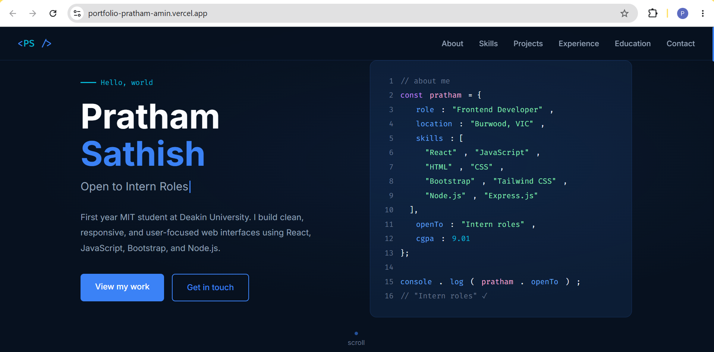
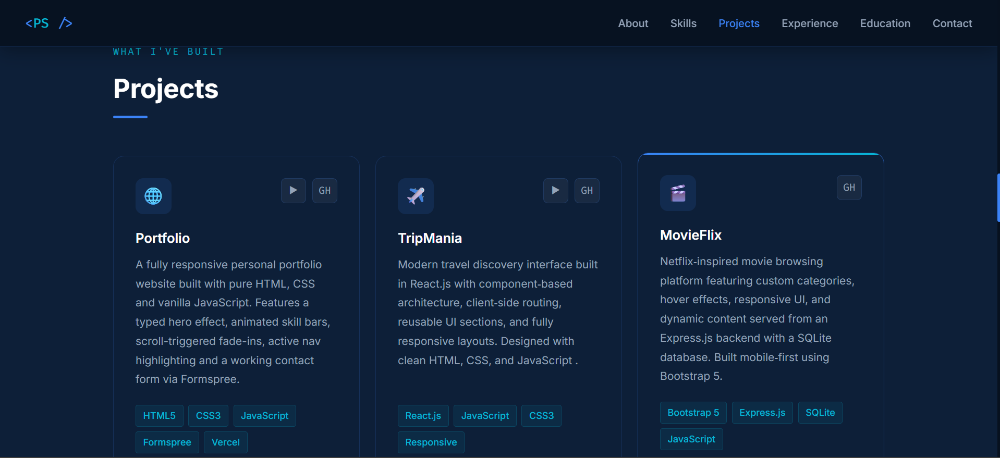
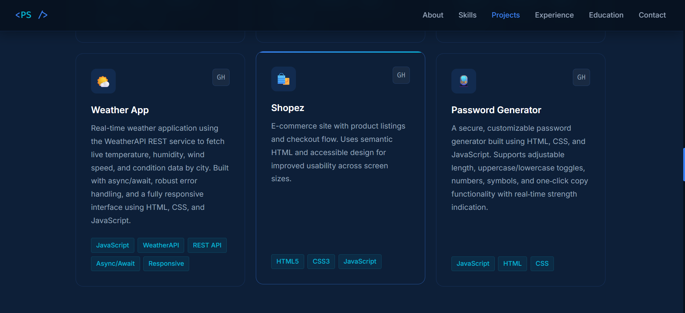
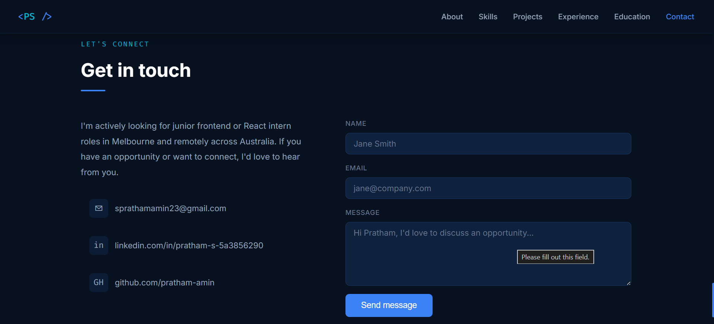

# 🌐 Pratham Sathish — Personal Portfolio

A fully responsive personal portfolio website built with pure HTML, CSS, and vanilla JavaScript — no frameworks, no build tools. Features smooth animations, a typed hero effect, animated skill bars, and a working contact form.



## 🔗 Live Demo
[View Live Portfolio](https://portfolio-pratham-amin.vercel.app/)

## 🛠️ Built With

- HTML5
- CSS3
- Vanilla JavaScript
- Formspree (contact form)
- Google Fonts (Inter + Fira Code)
- Vercel (deployment)

## ✨ Features

- Typed hero text effect cycling through roles
- Animated skill bars triggered on scroll
- Scroll-based fade-in animations on all sections
- Active nav link highlight as you scroll
- Fully responsive — mobile, tablet and desktop
- Working contact form via Formspree
- Navbar shadow on scroll
- Mobile hamburger menu
- Clean navy/blue professional theme

## 📸 Screenshots

### Hero Section


### Projects Section




### Skills Section


### Contact Section


## 🚀 Getting Started

No installation needed — pure HTML/CSS/JS.

### Run Locally

1. Clone the repo
```bash
git clone https://github.com/pratham-amin/Portfolio.git
```
2. Open `index.html` in your browser

That's it — no `npm install`, no build step needed.

### Deploy Your Own

1. Fork this repo
2. Go to [Vercel](https://vercel.com) → New Project → Import repo
3. Select **Other** as framework preset
4. Leave all build settings blank
5. Click **Deploy**

## ⚙️ Customisation

To make this your own:

| What to change | Where |
|---|---|
| Your name and bio | `index.html` — Hero and About sections |
| Typed phrases | `script.js` — `phrases` array at the top |
| Skill bar percentages | `index.html` — `data-w` attribute on each `.bar-fill` |
| Projects | `index.html` — duplicate a `.proj-card` block |
| Contact form | `script.js` — replace Formspree endpoint with yours |
| Colours | `style.css` — CSS variables at the top in `:root` |

## 📬 Contact Form Setup

1. Go to [Formspree.io](https://formspree.io) and create a free account
2. Create a new form and copy your endpoint ID
3. In `script.js` replace the fetch URL:

```javascript
fetch('https://formspree.io/f/YOUR_FORM_ID', {
  method: 'POST',
  body: new FormData(contactForm),
  headers: { 'Accept': 'application/json' }
});
```

## 🌐 Sections

| Section | Description |
|---|---|
| Hero | Name, typed role, CTA buttons, live code block |
| About | Bio, personal info, stat cards |
| Skills | Animated skill bars grouped by category |
| Projects | Project cards with GitHub and live demo links |
| Experience | Timeline of internships |
| Education | Full academic background |
| Contact | Contact info and working Formspree form |

## 👨‍💻 About Me

I'm a frontend developer and first year Master of IT student at Deakin University, Burwood. I completed my Bachelor's in Computer and Communication Engineering at NMAM Institute of Technology with a CGPA of 9.01.

- 📍 Burwood, VIC, Australia
- 📧 sprathamamin23@gmail.com
- 💼 [LinkedIn](https://linkedin.com/in/pratham-s-5a3856290)
- 💻 [GitHub](https://github.com/pratham-amin)

